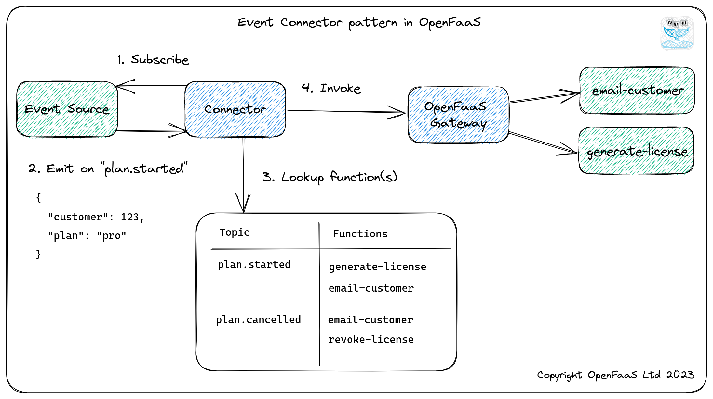

# Triggers

OpenFaaS functions can be triggered easily by any kind of event. The most common use-case is HTTP which acts as a lingua franca between internet-connected systems.

Connectors map one or more topics, subjects or queues from a stateful messaging system or event-source to a number of functions in your cluster.

Can't find the event-source or trigger that you were looking for? [Contact us for more info](https://openfaas.com/support)

## Built-in triggers

### HTTP / webhooks

This is the default, and standard method for interacting with your Functions.

The function URL follows the pattern of:

```
https://<gateway URL>:<port>/function/<function name>
```

### Async / NATS Streaming

You can execute a function or microservice asynchronously by replacing `/function/` with `/async-function/` when accessing the endpoint via the OpenFaaS gateway.

The function URL follows the pattern of:

```
https://<gateway URL>:<port>/async-function/<function name>
```

You can also pass an `X-Callback-Url` header with the URL of another endpoint for the response.

More on async: [Async Functions](/reference/async/)

### CLI

Trigger a function using the `faas-cli` by using the function name

```
echo "triggered" | faas-cli invoke figlet
```

> CLI invocation can also be async by passing the `-a` flag to the `invoke` call

Find out more: [faas-cli on GitHub](https://github.com/openfaas/faas-cli)

## Additional triggers

The OpenFaaS event-pattern allows you to create a broker or separate microservice which maps functions to topics and invokes functions via the OpenFaaS Gateway meaning that the OpenFaaS code does not need to be modified per trigger/event-source.



> Pictured: Event-connector pattern. One topic, subject or queue can be broadcast to multiple functions.

### Apache Kafka (OpenFaaS Pro)

Trigger your functions via [Apache Kafka](https://kafka.apache.org) topics.

[Read the documentation](https://docs.openfaas.com/openfaas-pro/kafka-events/)

See also:

* [Staying on topic: trigger your OpenFaaS functions with Apache Kafka](https://www.openfaas.com/blog/kafka-connector/)
* [Event-driven OpenFaaS with Managed Kafka from Aiven](https://www.openfaas.com/blog/openfaas-kafka-aiven/)

### Postgres (OpenFaaS Pro)

Trigger functions based upon Postgres events including: insert, update and delete.

[Request more info](https://openfaas.com/support/)

### AWS SQS (OpenFaaS Pro)

Trigger your functions from events within AWS by publishing events to various AWS SQS queues.

[Read the documentation](https://docs.openfaas.com/openfaas-pro/sqs-events/)

### Cron Connector

The [cron-connector](https://github.com/openfaas/cron-connector) can be used to trigger functions on a timed schedule. It uses traditional cron expressions.

See also: [Scheduling function runs](/reference/cron/) in the docs.

### MQTT Connector

The [MQTT Connector](https://github.com/openfaas/mqtt-connector) can be used in conjunction with an MQTT broker such as [emitter.io](https://emitter.io) or similar to respond to events from IoT devices and MQTT message producers.

Example usage: [Drone tracking project for Packet.com's session CES 2020](https://github.com/packet-labs/iot).

### Minio / S3

You can trigger OpenFaaS functions using Minio's webhook or Kafka integration.

* [Minio's webhook integration](https://blog.min.io/introducing-webhooks-for-minio/)
* [Minio's Kafka integration](https://docs.min.io/docs/minio-bucket-notification-guide.html#apache-kafka)

For S3 on AWS, see the AWS SQS Connector.

### NATS Pub/sub

OpenFaaS has a built-in queue system with NATS Streaming, however you can also invoke functions using the pub/sub mechanism of [NATS](https://nats.io) Core.

View the [nats-connector](https://github.com/openfaas/nats-connector)

### AWS SNS

AWS SNS subscriptions can be used to trigger OpenFaaS functions. The approach does not require any separate connector. You can subscribe to an SNS topic and confirm the subscription via HTTP.

The AWS SDKs can be used to manage the subscription and to verify messages.

### CloudEvents

[CloudEvents](https://cloudevents.io/) is a specification for describing event data in a common way.

No connector is required to trigger OpenFaaS functions using CloudEvents.

Follow this example to learn how to trigger functions using the Azure EventGrid and CloudEvents: [johnmccabe/cloudevents-slack-demo](https://github.com/johnmccabe/cloudevents-slack-demo)

### RabbitMQ (third-party project)

Invoke functions from RabbitMQ topics. This is a third party project.

More information in the repository: [templum/rabbitmq-connector](https://github.com/Templum/rabbitmq-connector)

### IFTTT

You can trigger OpenFaaS functions using webhooks sent via the (if this, then that) service.

An example may be triggering a function which forwards Tweets about your brand or project to a given Slack channel. For this combination use the "Twitter search" Applet and have it trigger the "Make a web request" Applet giving the public URL of your OpenFaaS gateway and the receiver function such as https://gw.my-company.com/function/slack-forwarder

See an example of a function built to forward Tweets from IFTTTT to Slack using Golang: [filter-tweets](https://github.com/openfaas-incubator/social-functions/blob/master/filter-tweets/handler.go).

Visit [ifttt.com](https://ifttt.com) to learn more.

### VMware vCenter

The vcenter-connector by OpenFaaS is an event connector built to consume events from [VMware's vCenter product](https://en.wikipedia.org/wiki/VCenter).

> With this project your functions can subscribe to events generated by the changes in your vCenter installation - for instance a VM being created, turned on or deleted. By using the connector you can extend the behaviours and functionality of vCenter and create custom workflows for your platform.

Status: if you require support for this project, [reach out to us for more info](https://openfaas.com/support/)

Link: [openfaas-vcenter-connector](https://github.com/openfaas-incubator/openfaas-vcenter-connector)

### Pushbullet (third-party project)

Invoke functions from [Pushbullet](https://www.pushbullet.com) channels. This is a third party project.

More information in the repository: [MrSimonEmms/openfaas-pushbullet-connector](https://github.com/MrSimonEmms/openfaas-pushbullet-connector)